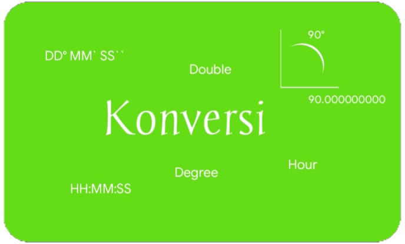

<p align="center">
  
</p>

<h2 align="center"><b>Konversi</b></h2>

<p align="center">
<!-- Latest release -->

<!-- Jitpack release -->

<!-- Github Repo size -->

<!-- Build with Kotlin -->

<!-- License -->

</p>

## Tentang Library Konversi

Library untuk mengkonversi format DMS ke Desimal (Double) &amp; format Desimal (Double) ke derajat menit detik (DMS) /jam menit detik (HMS), untuk keperluan komputasi terutama perhitungan Astronomi/Falak.

## Fitur

- [x] mengubah format DMS/HMS ke Double
- [x] mengubah format Double ke j m d
- [x] mengubah format Double ke DMS, ada beberapa varian 
- [x] mengubah format Double ke HMS, ada beberapa varian
- [x] Extension function Double.round(), untuk mengcustom pembulatan dibelakang koma

## Konfigurasi pertama

1. masukkan kode ini ke settings.gradle.kts (root kotlin dsl) di blok ```repositories```
```kotlin.kts
  dependencyResolutionManagement {
    repositories {
      // contoh
      maven {
        url = uri("https://jitpack.io")
      }
    }
  }
```
jika menggunakan groovy dsl
```groovy
  repositories {
    ...
    maven { url 'https://jitpack.io' }
  }
```
2. masukkan dependensi ke build.gradle.kts (app/build.gradle.kts kotlin dsl)
di blok ```dependencies``` 

```kotlin.kts
implementation("com.github.andihasan97:lib-konversi:3.1.0")
```
jika menggunakan groovy dsl
```groovy
implementation 'com.github.andihasan97:lib-konversi:3.1.0'
```

## Tutorial Youtube

Praktik implementasi library hisab irsyadul murid

Part 1 [Membuat layout](https://youtu.be/UXJz_lqkXwk)
Part 2 [Implementasi library](https://youtu.be/LefWCSdcV8s)
Part 3 [Implementasi library](https://youtu.be/AxQ_ATx0imk)

## Daftar fungsi

```kotlin.kt

/* 
  fungsi mengubah DMS ke Double, jika bernilai negatif,
  wajib memasukkan tanda negatif (-) disetiap input DMS.
  parameter second bisa menerima integer/double
*/
fun toDecimal(degree: Int, minute: Int, second: Number): Double

// tipe Number berarti menerima tipe Integer/Double
// jika true maka positif, jika false maka negatif
fun toDecimalCheck(degree: Int, minute: Int, second: Number, check: Boolean): Double

// HH:MM detik dibulatkan ke menit, menit ke jam jika menit == 60
fun toTime(decimal: Double): String

// positif/negatif : sama-sama dibulatkan keatas/menjauhi nol
fun toTimeWithMinus(decimal: Double): String

// HH:MM:SS angka dibelakang koma orde detik tidak dibulatkan ke detik integer
fun toTimeFull(decimal: Double): String

// HH:MM:SS angka dibulatkan ke detik
fun toTimeFullRound(decimal: Double): String

// HH:MM:SS,ss dibulatkan ke 2 angka di belakang koma 
fun toTimeFullRound2(decimal: Double): String

// DD° MM' SS" angka dibelakang koma orde detik tidak dibulatkan ke detik integer
fun toDegreeFull(decimal: Double): String

// DD° MM' SS" angka dibulatkan ke detik
fun toDegreeFullRound(decimal: Double): String

// DD° MM' SS,ss" dibulatkan ke 2 angka di belakang koma
fun toDegreeFullRound2(decimal: Double): String

// HH:MM:SS,ss dibulatkan ke 2 angka di belakang koma, dengan tanda minus
fun toTimeFullRound2WithMinus(decimal: Double): String

// HH j MM m SS,ss d dibulatkan ke 2 angka di belakang koma
fun toCounterTimeRound2WithMinus(decimal: Double): String

// Extension Function Round, custom round membulatkan angka di belakang koma
fun Double.round( decimals : Int ) : Double

```

## Ingin berkontribusi?

> Jika Anda ingin berkontribusi, silahkan menggarpu (Fork) repositori ini, buat perubahan, kirim Pull request ke repositori ini

## Kontak Kami

- [Telegram](https://t.me/moonelfalakiy)

## License

```
Library Konversi
Copyright (C) 2023  Andi Hasan Ashari

Library Konversi is free software: you can redistribute it and/or modify
it under the terms of the GNU General Public License as published by
the Free Software Foundation, either version 3 of the License, or
(at your option) any later version.

Library Konversi is distributed in the hope that it will be useful,
but WITHOUT ANY WARRANTY; without even the implied warranty of
MERCHANTABILITY or FITNESS FOR A PARTICULAR PURPOSE.  See the
GNU General Public License for more details.

You should have received a copy of the GNU General Public License
along with Library Konversi.  If not, see <https://www.gnu.org/licenses/>.
```
Report to us if anyone violates the terms of the License, either by creating issues or writing to us directly.
